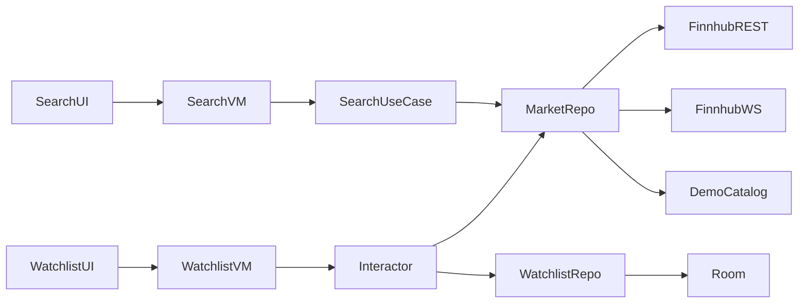
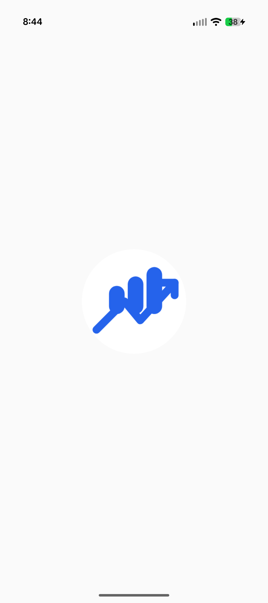
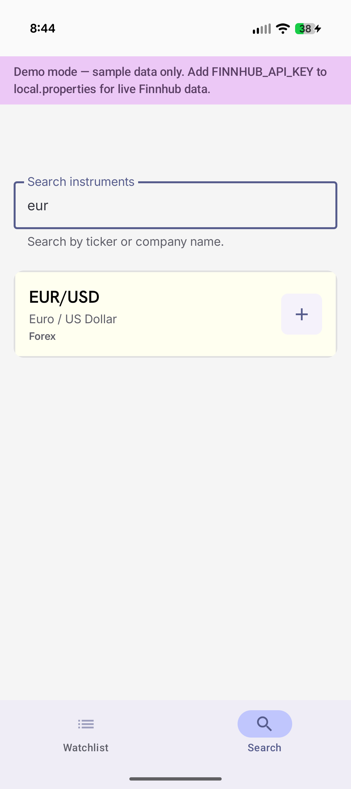
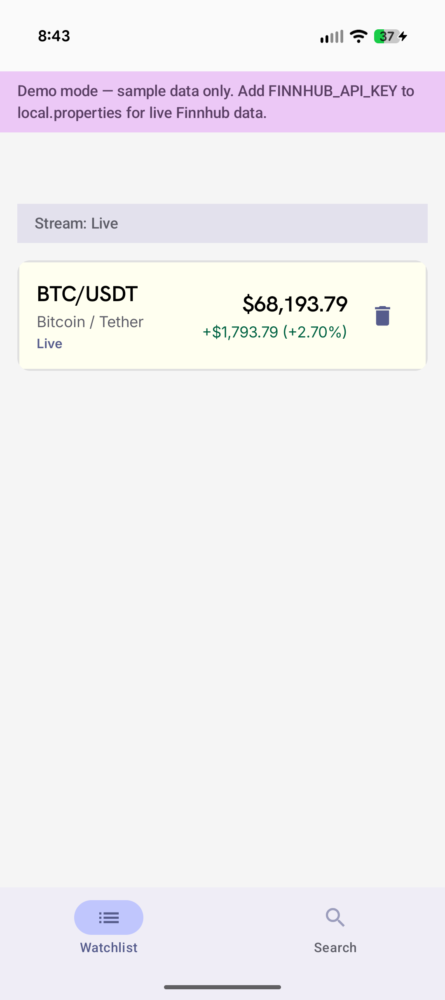
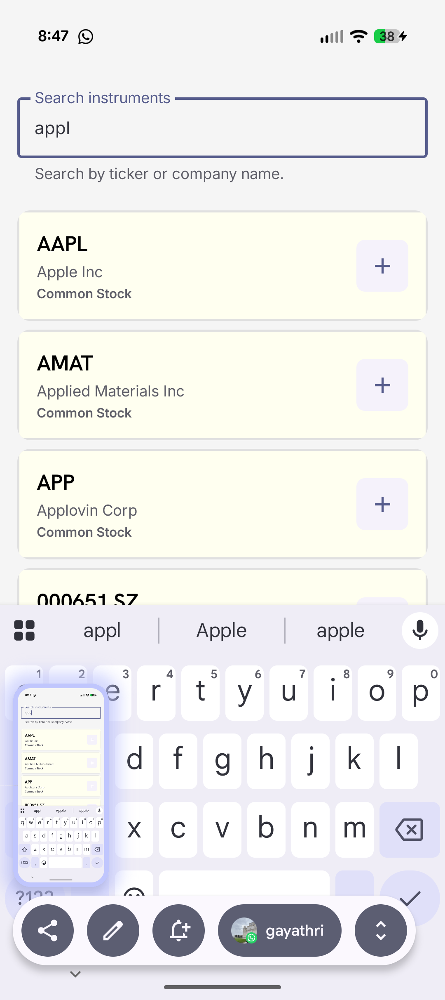
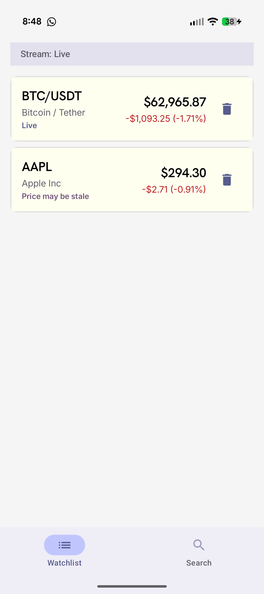

# Real-Time Watchlist


## Build and run instructions

### Prerequisites

- **Android Studio** Ladybug or newer (recommended)
- **JDK 11+** (project uses Android Studio’s bundled JBR via `gradle.properties`)
- **Android device or emulator** — API 24+ (Android 7.0)
- **Finnhub API key** (optional — see [Demo / fake-data mode](#demo--fake-data-mode) below)
  (Get a free key at [finnhub.io](https://finnhub.io/).)

### Gradle notes

- `FINNHUB_API_KEY` and `DEMO_MODE` are injected into `BuildConfig` at build time from `local.properties`.
- After changing `local.properties`, sync Gradle and rebuild so `BuildConfig` picks up new values.

---

## Demo / fake-data mode

Reviewers can run the full product flow **without a Finnhub API key**, market hours, or rate limits.

### When demo mode is active

Demo mode turns on automatically when `FINNHUB_API_KEY` is **missing or blank**. You can also force it by adding ```DEMO_MODE=true```

- **Search** — filters a local catalog (`DemoMarketCatalog`: AAPL, MSFT, BTC, EUR/USD)
- **Quotes** — returns fixed snapshot prices from the catalog
- **Live prices** — `FakeMarketDataRepository` emits simulated price ticks (~every 2 s with small jitter)
- **Watchlist** — still persisted in Room; add/remove works normally
- **UI** — a demo mode banner appears at the top of the home screen

Finnhub Retrofit and WebSocket clients are **not created** in demo mode. Hilt swaps only `MarketDataRepository` via a `Provider`-based `@Provides` binding.

### Live mode

Provide a valid key and ensure demo mode is not forced.
- **REST** — `/search` and `/quote` for instrument search and initial snapshots
- **WebSocket** — Finnhub trade stream for live updates (`wss://ws.finnhub.io`)

---

## Architecture and tradeoffs

### Layered structure

```
UI (Jetpack Compose + ViewModels)
        ↓
Domain (use cases, interactors, models, repository interfaces)
        ↓
Data (Room, Retrofit, OkHttp WebSocket, demo fakes)
```

**Tech stack:** Kotlin, Jetpack Compose, Coroutines/Flow, Hilt, Room, Retrofit, OkHttp, kotlinx.serialization.

### Key components

- **`SearchViewModel`** — exposes `SearchUiState` via `StateFlow`; delegates debounced search + watchlist membership to `SearchWithWatchlistUseCase`
- **`WatchlistViewModel`** — maps `WatchlistInteractor` overview into `WatchlistScreenState`
- **`WatchlistInteractor`** — application-scoped singleton; merges Room watchlist, REST quotes, WebSocket ticks, stale detection, and connection state
- **`SearchWithWatchlistUseCase`** — combines debounced query flow with watchlist symbols to enrich search results reactively
- **`MarketDataRepository`** — abstraction over Finnhub (`FinnhubMarketDataRepository`) or demo data (`FakeMarketDataRepository`)
- **`RoomWatchlistRepository`** — persists watchlist across app launches
- **`FinnhubWebSocketClient`** — single socket, dynamic subscribe/unsubscribe, exponential backoff reconnect

### Data flow



### UI updates

- **Material 3** theming with dedicated light-theme colors
- **Search screen** — debounced search field, loading/empty/error/no-results states, add-to-watchlist with in-list indicator
- **Watchlist screen** — price, change, percent change with up/down color indicators, live/stale/unavailable status labels, connection banner, pull-to-refresh, remove action
- **Adaptive layout** — bottom navigation on phones; navigation rail on wider screens; two-column grids on expanded width
- **Accessibility** — content descriptions for watchlist entries, price changes, stream status, and actions
- **Demo banner** — visible whenever `BuildConfig.DEMO_MODE` is true
- **Compose previews** — `@Preview` fixtures via `PreviewSampleData` for search and watchlist states

### Tradeoffs

- **`WatchlistInteractor` vs fat ViewModel** — quote/stream merging and stale logic stay testable without Android APIs; WebSocket subscriptions survive tab switches
- **Reactive search pipeline** — `SearchWithWatchlistUseCase` combines query + watchlist symbols so the ViewModel does not hold mutable watchlist state
- **`Flow<Set<String>>` for watchlist symbols** — communicates membership-check intent; avoids per-result DB lookups
- **Trade stream as live price** — Finnhub free WebSocket sends trades, not consolidated quotes; last trade price is shown as live
- **30 s stale threshold** — prices older than 30 s (or while reconnecting without fresh ticks) are labeled stale, not silently “live”
- **Single WebSocket connection** — matches Finnhub’s one-connection-per-key limit; dynamic subscribe/unsubscribe
- **No offline quote cache** — symbols persist in Room; prices refetched on launch — keeps scope manageable
- **Demo mode via repository swap** — minimal surface area; reviewers get the same UI and persistence without network
- **Local `WindowSizeClass`** — could not reliably download `material3-window-size-class` (Maven SSL/PKIX failure in this environment); implemented equivalent breakpoints locally via `LocalConfiguration`

### Finnhub assumptions and limitations (free tier)

Documented per assignment requirements:

- REST rate limits apply — HTTP **429** surfaces a user-facing error
- WebSocket supports a limited number of concurrent subscriptions (commonly ~50)
- US stock trades are most reliable during **market hours**; crypto often needs exchange-prefixed symbols (e.g. `BINANCE:BTCUSDT`)
- `/quote` may return `c = 0` when no current price exists — shown as unavailable (`—`)
- WebSocket reconnect uses exponential backoff (2 s base, 60 s cap; longer delay on 429)

---

## Requirements coverage

### Product goal

1. Search for instruments — done
2. Add and remove watchlist items — done
3. See latest known price per item — done
4. Live price updates while app is running — done  
   Notes: WebSocket in live mode; simulated ticks in demo mode
5. Loading, empty, error, stale, and reconnecting states — done

### Technical expectations

1. Kotlin — done
2. Jetpack Compose — done
3. Coroutines and Flow — done
4. Dependency injection (Hilt) — done
5. Local persistence (Room) — done
6. Relevant unit tests — done

### Required features

1. REST for search + initial quotes — done  
2. WebSocket for live updates — done  
3. Persist watchlist across launches — done  
4. Compose-safe observable screen state — done  
5. API errors — done  
6. Empty results — done  
7. Missing prices — done  
8. Network loss — done  
9. Stream reconnects — done  
10. README (setup, architecture, tradeoffs, AI note) — done  
11. Documented demo / fake-data mode — done  

### Optional enhancements

1. Price movement indicators — done  
2. Pull to refresh — done  
3. UI tests — done  
4. Screenshot tests — done

---

## Tests

### Unit tests (`app/src/test`)

- **`SearchViewModelTest`** — successful search, failed search (error message), add-to-watchlist updates UI, demo catalog search
- **`WatchlistInteractorTest`** — empty watchlist, REST quote → live entry, WebSocket price override
- **`DemoMarketCatalogTest`** — demo search filtering and quote lookup
- **`FakeMarketDataRepositoryTest`** — demo repo search/quotes, subscription lifecycle, price update flow

### Instrumented / UI tests (`app/src/androidTest`)

- **`SearchScreenTest`** — idle, results, add button, added state, error banner, no results, query input
- **`WatchlistScreenTest`** — empty, entries, connection banner, remove button, loading
- **`HomeNavigationTest`** — bottom bar tabs, tab switching, shell content
- **`DemoModeBannerTest`** — demo banner visibility


### How to run

- Unit: right-click `app/src/test/java` → **Run 'Tests in …'**
- UI: start an emulator, then right-click `app/src/androidTest/java` → **Run 'Tests in …'**

**Command line**
```bash
./gradlew :app:testDebugUnitTest
./gradlew :app:connectedDebugAndroidTest   # requires device/emulator
```

## Future optimizations (not covered in optional requirements)
1. **Replace faked `WindowSizeClass`** — `material3-window-size-class` failed to download because of Maven SSL/PKIX error. 
2. More UI polish

## AI / tooling assistance
This project was implemented with assistance from **Cursor** (AI pair programming) for scaffolding, boilerplate, test setup, and documentation. Architectural decisions, tradeoffs, and final code structure were reviewed by me and intentionally kept focused on the assignment scope.

# Screenshots
launcher, demo and live screenshots
<p>
  
  
  

  
</p>